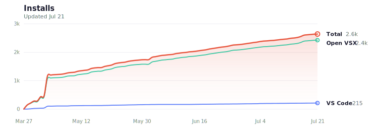

# Glassy

Bring a glass-like translucent window effect to VS Code on macOS.

Glassy adds adjustable window transparency so your editor stays readable while your wallpaper and desktop ambience subtly come through in the background.

## Features

- Adjust window opacity with keyboard shortcuts
- Tune opacity and step size from Settings
- Jump to maximum transparency or reset to fully opaque
- Re-apply the patch automatically after some VS Code updates

## Preview

Glassy is designed to keep the editor usable while adding a soft glass effect over dark, ambient, or high-contrast backgrounds.

### Dark wallpaper

### Ambient background

### Bright high-contrast background

## Setup

1. Open the Command Palette (`Cmd+Shift+P`)
2. Run **"Glassy: Enable Transparency"**
3. Confirm the prompt
4. Restart VS Code when prompted, or **Quit VS Code** (`Cmd+Q`) and reopen it manually

> Glassy modifies VS Code's internal app files to enable transparency. Because of that, enabling or disabling the effect requires a restart.

## Usage

| Shortcut | Command |
|----------|---------|
| `Cmd+Option+Z` | Increase opacity (less transparent) |
| `Cmd+Option+C` | Decrease opacity (more transparent) |
| `Cmd+Option+X` | Reset to fully opaque |

You can also:

- adjust opacity in **Settings > Glassy**
- run **"Glassy: Maximum Transparency"** from the Command Palette to jump to the lowest supported opacity
- run **"Glassy: Disable Transparency"** to remove the patch and restore the normal window

## Settings

| Setting | Default | Description |
|---------|---------|-------------|
| `glassy.alpha` | `240` | Opacity level (10 = very transparent, 255 = fully opaque) |
| `glassy.step` | `4` | Step size per keypress |

### Recommended Values

- **250-255** Subtle transparency
- **240-250** Light transparency
- **220-240** Moderate (text still readable)
- **Below 200** Heavy (text starts to fade)

## How It Works

Glassy patches VS Code's Electron main process to enable `BrowserWindow.setOpacity()`. When you change opacity, the extension writes the new value to a local config file and the patched app applies the update to the current window.

## Uninstalling

1. Run **"Glassy: Disable Transparency"** from the Command Palette
2. Restart VS Code when prompted, or quit and reopen it manually
3. Uninstall the extension if you no longer want to keep Glassy installed

This removes the patch and restores VS Code to its original state before the extension is uninstalled.

## Requirements

- macOS 12.0 or later
- Glassy detects the currently running app automatically and also falls back to common VS Code, VS Code Insiders, Cursor, Antigravity, and VSCodium locations in `/Applications` or `~/Applications`

## Known Limitations

- Requires patching VS Code's internal files, which may trigger a modified or corrupt installation warning
- Glassy attempts to re-apply the patch automatically after VS Code updates, but some updates may still require a manual restart
- Transparency applies to the entire window including text content

## Install Stats

## License

[MIT](LICENSE)
